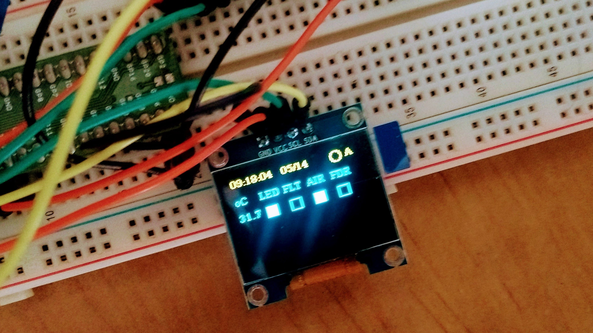

### Cron jobs, interval jobs, dated jobs



My project here needed me to schedule jobs , code functions running at specific times of the day, on all days. [My aquarium and IoT](https://kneerunjun.github.io/aquascape-minder/). Here the aquarium needed specific electrical accessories to be turned ON /OFF depending on the time of the day. This ensures optimum run time for all the accessories and also lets the aquarium owners be hands-off from the sustenance tasks.

For people who don't like any 3rd party software / packages / frameworks written for them , would of course rely on a __continuous loops__ checking for the current time. A bit of time calculations and formatting in python (which I don't think is too cumbersome) can still get you there.

Like how about this ?

```python
import threading
def t_checktime(trigg,ke):
  while not ke.wait(1):
    if is_it_time_to_check() == True:
      trigg()
    else:
      continue
def trigg():
  do_some_switchboard()

if __name__ == "__main__":
  killEvent = threading.Event()
  check_time_task  = threading.Thread(target=t_checktime, args=(trigg,killEvent))
  check_time_task.start()
  check_time_task.join()
```

But here is something that I found handy to schedule cron like jobs. [ApScheduler](https://apscheduler.readthedocs.io/en/latest/userguide.html)

An Excerpt from web , describes the package quite succinctly

>Advanced Python Scheduler (APScheduler) is a Python library that lets you schedule your Python code to be executed later, either just once or periodically. You can add new jobs or remove old ones on the fly as you please. If you store your jobs in a database, they will also survive scheduler restarts and maintain their state. When the scheduler is restarted, it will then run all the jobs it should have run while it was off line

### Non blocking background scheduler :

Setting up the scheduler and starting it is quite simple and easy

```python
from apscheduler.schedulers.background import BackgroundScheduler
sched = BackgroundScheduler()
sched.start()
# yeah ! and thats all what is required to start a scheduler
```

Above doesn't do too many things - simply cause it hasn't got any jobs scheduled for now. So what can you do to schedule jobs for this scheduler ?

```python
sched = BackgroundScheduler()
@sched.scheduled_job('cron', hour='6-10', minute='0-59', timezone="Asia/Kolkata")
def call_this_on_trigger():
  # dosomething here that you want to between 06:00-10:59
  # this is fired everyminute between that time slot
  pass
sched.start()
```

Using decorators is always better , one for it makes you look cool, and two, then recollecting the logic at a later date is so very easy. If you are not a big fan of using the decorators in python here is a more traditional approach to adding jobs to the scheduler -A distinct function call to add and to remove the jobs.

Now you see why decorators are neat ? Letting the job have an `id` would mean you can retrieve the job and then access all the functions on it.

```python
scheduler.add_job(myfunc, 'interval', minutes=2, id='my_job_id')
scheduler.remove_job('my_job_id')
```
Pausing and resuming the scheduler is straight function calls. This would nullify all the triggers while keeping the scheduler alive.

```python
scheduler.pause()
scheduler.resume()
```

Finally shutting down the scheduler

```python
scheduler.shutdown()
```
> This by no means to replace the API documentation. The intention is just to help to get jump started with the scheduler without having to dig deep into the documentation. So while you can get your initial program working with this, for in depth information it is still recommended to refer to the official API documentation
